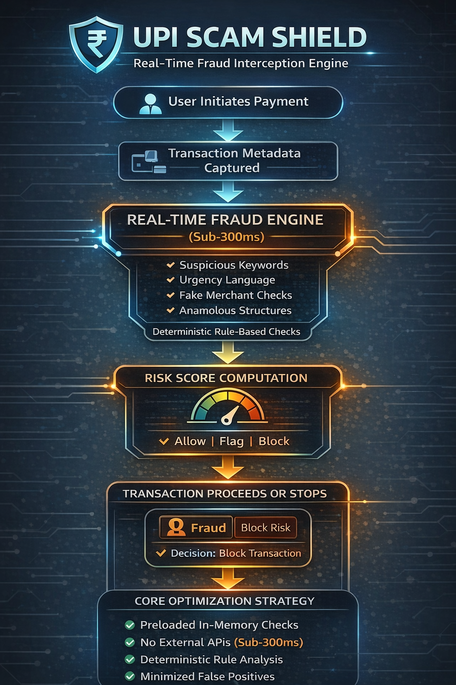

UPI Scam Shield 

Real-Time Pre-Transaction Fraud Interception Engine 

Theme: Cyber Threat Detection Systems 
Team: Team Rocket 
Development Environment: Built using TRAE IDE (AI-assisted coding) 

1. Problem Statement 
Digital payment fraud through UPI platforms has increased significantly due to social engineering, fake merchant identities, refund scams, and impersonation tactics. 

Current systems detect fraud only after money has been transferred. This reactive approach makes recovery difficult. 

-> The challenge requires building a real-time fraud interception engine capable of detecting and blocking fraudulent transactions within sub-300 milliseconds while minimizing false positives. 

2. Solution Overview 
UPI Scam Shield is a lightweight, real-time fraud interception engine designed to operate within a UPI transaction pipeline. 

The system evaluates transaction metadata before authorization and returns a fraud decision within 300 milliseconds. 

It generates: 

->Fraud Probability Score (0–100) 
->Risk Classification (Safe / Suspicious / High Risk) 
->Explanation of detected indicators 
->Interception decision (Allow / Flag / Block) 

The system is optimized for speed, deterministic scoring, and low false-positive rates. 

3. Real-Time Architecture Design 
Transaction Interception Flow 

User Initiates Payment 
→ Transaction Metadata Captured 
→ Real-Time Fraud Engine (Sub-300ms) 
→ Risk Score Computation 
→ Decision Layer (Allow / Flag / Block) 
→ Transaction Proceeds or Stops 

The fraud engine is designed as a pre-authorization validation layer within the transaction flow. 

4. Core Architecture Components
   
   
4.1 Input Layer 

Captures: 

1. UPI ID 
2. Merchant Identifier 
3. Phone Number 
4. QR Code Data 
5. Transaction Amount 
6. Message Context (if available)
   
4.2 Input Validation Module 

Performs lightweight checks: 

UPI format validation 
Character pattern validation 
Token extraction 
Merchant naming structure analysis 
This ensures consistent structured input for fast evaluation. 

4.3 Real-Time Fraud Detection Engine 
The engine uses deterministic rule-based scoring optimized for low-latency execution. 

It evaluates: 

- Suspicious keywords (refund, verify, KYC, OTP, urgent, etc.) 
- Urgency-based manipulation phrases 
- Impersonation-style UPI handles (support@, refund@, official@) 
- Anomalous naming patterns (excessive digits, random sequences) 
- Micro-payment verification traps (₹1 validation scam) 
- Contextual scam indicators in messages
  
All rules are precompiled and evaluated in-memory for minimal latency. 

No external API calls are required, ensuring consistent performance. 

5. Risk Scoring Model 
Fraud Score is calculated using weighted multi-factor evaluation: 

Example weights: 

Suspicious keyword: +15 
Urgency manipulation detected: +20 
Impersonation pattern: +25 
Anomalous UPI structure: +20 
Refund/KYC scam structure: +30 
Final Fraud Score = Sum of applicable risk weights (capped at 100) 

6. False Positive Minimization Strategy 
To reduce incorrect blocking of legitimate transactions: 

No single keyword triggers High Risk 
Multi-factor scoring required for escalation 
Threshold-based classification 
Context-aware validation instead of isolated word detection 
Weighted scoring prevents overreaction to minor indicators 
Classification thresholds: 

0–30 → Safe (Allow) 
31–65 → Suspicious (Warn) 
66–100 → High Risk (Block / Strong Alert) 
This ensures balanced detection accuracy. 

7. Performance Optimization Strategy 
The system is designed to meet sub-300ms latency by: 

Using lightweight deterministic logic 
Preloading rule dictionaries into memory 
Avoiding external API dependencies 
Using optimized string matching techniques 
Maintaining minimal computational complexity 
Because no heavy ML inference is used, response time remains predictable and consistent. 

8. Execution Flow 
-> User initiates payment.
-> Transaction metadata is passed to the fraud engine. 
-> Validation and rule evaluation execute in memory. 
-> Risk score is computed instantly. 
-> Classification decision is returned within 300ms. 
-> System allows, flags, or blocks the transaction.
   
10. Example Scenario 
Input: 

UPI ID: support-refund@okaxis 
Message: “Your refund is pending. Send ₹1 to verify.” 

Detected Indicators: 

-> Refund scam pattern 
-> Urgency-based manipulation 
-> Impersonation-style merchant naming 

Fraud Score: 85 
Classification: High Risk 
Decision: Block Transaction 

The fraud is intercepted before money moves. 

10. Alignment with Challenge Goal 

UPI Scam Shield satisfies the challenge requirements by: 

- Operating as a real-time transaction interception engine 
- Delivering risk decisions within sub-300ms 
- Using optimized deterministic scoring 
- Minimizing false positives through multi-factor evaluation 
- Preventing fraud during the transaction, not after 
The system shifts fraud detection from reactive to proactive defense. 

11. Future Enhancements 

- Integration with live fraud intelligence feeds 
- Behavioral anomaly modeling 
- Machine learning-based contextual scoring 
- Bank-side transaction gateway integration 
- Large-scale distributed fraud monitoring 
 
